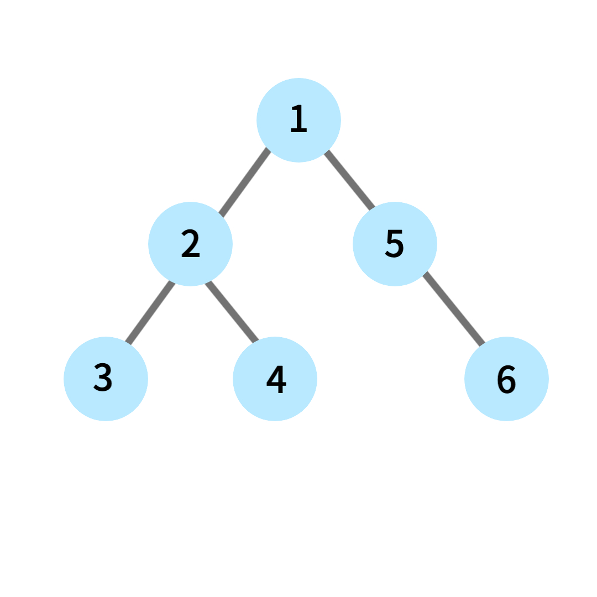

# Search

- 주어진 데이터에서 자신이 원하는 데이터를 찾아내는 알고리즘
- 수많은 데이터 속에서 특정 항목을 찾아내기 위해 사용한다.

  ex) 포털 사이트에서 검색어 입력, 전화번호부에서 전화번호 찾기, 특정 지역의 특정 업체 주소 찾기

## DFS(depth-first search)

- 깊이 우선 탐색, 그래프 완전 탐색 기법 중 하나
- 그래프의 시작 노드에서 출발하여 탐색할 한 쪽 분기를 정해 최대 깊이까지 탐색을 마친 후 다른 쪽 분기로 이동해 다시 탐색을 수행하는 알고리즘
- `재귀 함수`로 구현하기 때문에 스택 오버플로(stack overflow)에 유의해야한다
- `LIFO(Last In First Out)` 특성을 띄며 스택(stack) 자료구조를 이용한다
- 시간복잡도: `O(V + E)`

  - `V`: 노드 수
  - `E`: 엣지 수

  ex) 경로 탐색(최단 거리, 시간), 네트워크, 모든 조합 만들기
