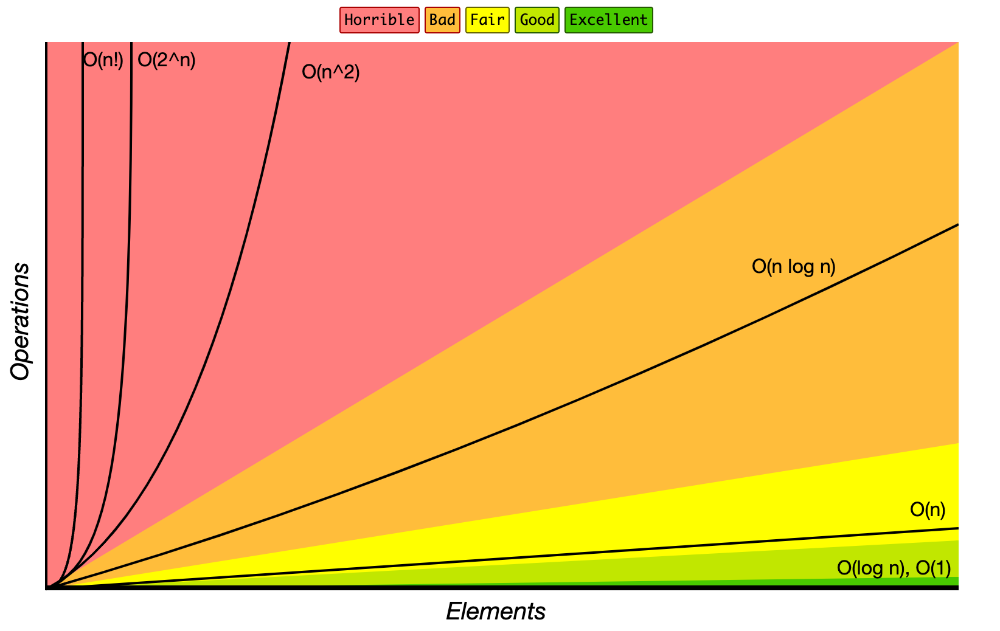

# 시간 복잡도

## 정의

- 주어진 문제를 해결하기 위한 연산 횟수

## 목적

- 코드의 비효율적인 로직 개선

## 유형

- 빅-오메가(Ω(n)): 최선일 때(best case)의 연산 횟수를 나타낸 표기법
- 빅-세타(Θ(n): 보통일 때(average case)의 연산 횟수를 나타낸 표기법
- **빅-오(O(n))**: 최악일 때(worst case)의 연산 횟수를 나타내는 표기법

`💡 시간 복잡도를 판단할 때는 최악일 때(worst case)를 염두해 둬야 한다.`

## 빅-오 표기법(O(n))의 시간 복잡도

## 도출 기준

- 상수는 시간 복잡도 계산에서 제외된다.
- **가장 많이 중첩된 반복문의 수행 횟수**가 시간 복잡도의 기준이 된다.

 
 

---

## 참고

- https://www.bigocheatsheet.com/
