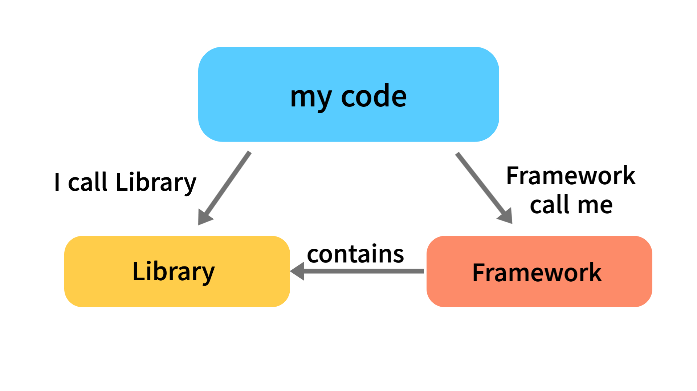

# Framework vs Library

- 기준: 제어의 흐름이 어디에 있는가?
  

## Framework

- 뼈대, 구조
- 더 많은 동작이 내장된 추상적인 디자인 구현
- 전체적인 흐름을 스스로 쥐고 있어 유저는 그 안에 필요한 코드를 넣는다 → `Hollyword principle`: Don't call us, we'll call you([IoC](../Nest.js/DI_IoC.md) 참고)
- ex) Spring, Nest.js, Django

## Library

- 기본적으로 호출할 수 있는 함수 집합
- 유저가 전체적인 흐름을 만들면서 라이브러리를 가져다 사용 → 클라이언트에게 제어권 반환
- ex) Network protocols, C++ STL, npm & pip module

### reference

- https://martinfowler.com/bliki/InversionOfControl.html
- https://kldp.org/node/124237
- https://webclub.tistory.com/458
