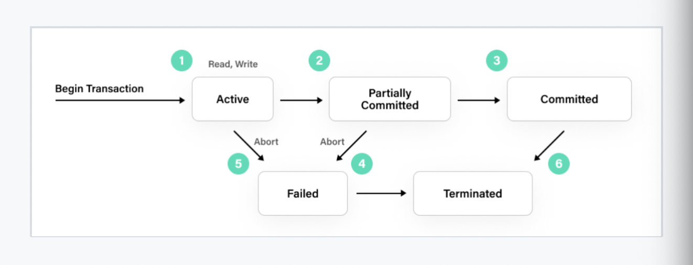
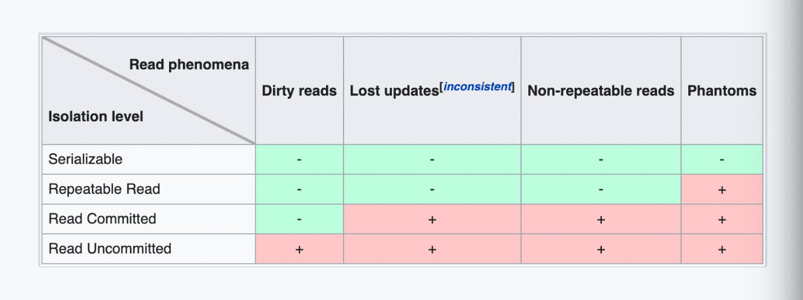

# Transaction Isolation Level(트랜잭션 격리 수준)

# Transaction

- 데이터베이스에서 단일로 수행되는 작업.
- 묶어서 실행하고 싶은 SQL 명령 또는 단계적으로 처리해야할 때 트랜잭션 내에서 실행한다.
- MySQL 클라이언트에서 명령을 실행할 때에는 자동커밋이 켜져있어 트랜잭션을 사용하여 데이터를 추가할 때는 다음 명령어를 사용해 **자동커밋을 꺼야**한다.

  > 자동커밋? 클라이언트 툴의 기능으로 자동으로 커밋해주는 기능이다.

- 여러 동시 요청이 데이터베이스 내의 데이터를 동시에 변경하는 경우, 충돌을 피하기 위해 요청을 서로 격리해야 한다.

  > - A 계좌에서 B 계좌로 1달러를 전송하는 로직을 구상해보자.
  >
  >   - A 계좌에서 1달러를 출금한다.
  >
  >   - B 계좌에서 1달러를 입금한다.
  >
  > 두 작업은 중간에 방해를 받으면 안되기 때문에 하나의 작업으로 묶어 진행된다.

- **커밋(commit)**: 트랜잭션 내에 실행한 (변경된)명령을 적용하고 종료한다.
- **롤백(rollback)**: 트랙잭션 내에 실행한 명령을 파기하고 종료하므로 변경한 내용이 적용되지 않는다.

  ```sql
  /* MySQL */
  START TRANSACTION

  /* SQL Server, PostgreSQL */
  BEGIN TRANSACTION

  COMMIT
  ROLLBACK
  ```

  </img>

### ACID 원칙

|                         |                                                                                                  |
| ----------------------- | ------------------------------------------------------------------------------------------------ |
| **Atomic(원자성)**      | 트랜잭션과 관련된 작업(commit, rolled back)이 부분적으로 실행되다가 중단되지 않는 것을 보장한다. |
| **Consistency(일관성)** | 데이터베이스는 각 commit 또는 rolled back 후에 일관성있는 상태를 유지한다.                       |
| **Isolation(격리성)**   | 트랙잭션 수행시, 다른 트랜잭션의 연산 작업이 끼어들지 못하도록 보장한다.                         |
| **Durability(지속성)**  | 성공적으로 수행된 트랜잭션은 영원히 반영되어야 한다.                                             |

## Transaction Isolation Level

- ACID 원칙 중 하나로 데이터베이스에 동시에 접근할 때, 어떻게 그 접근을 처리할지에 대한 설정이다.

- **READ UNCOMMITTED**

  - 가장 낮은 격리 수준으로, 트랜잭션이 다른 트랜젝션의 commit 전 데이터를 읽는 것을 허용한다.
  - `Dirty read`, `Non Repeatable Read`, `Phantom Read`가 발생한다.

- **READ COMMITTED**

  - 트랜잭션이 다른 트랜젝션의 commit된(변경된) 데이터만 읽도록 한다.
  - `Non Repeatable Read`, `Phantom Read`가 발생한다.

- **REPEATABLE READ**

  - READ_COMMITTED와 동일하게 트랜잭션이 다른 트랜젝션의 commit된(변경된) 데이터만 읽도록 한다.
  - 한 트랜잭션이 조회한 데이터는 트랜잭션 종료시까지 항상 동일하다.(다른 트랜젝션이 수정, 삭제하는 것을 막음)
  - `Phantom Read`가 발생한다.

- **SERIALIZABLE**

  - 한 트랜잭션에서 사용하는 데이터는 다른 트랜잭션에서 접근할 수 없다.
  - ACID 원칙은 가장 잘 지키나 그만큼 성능이 떨어진다.

</img>

### Transaction 위반 사항

- Dirty read

  - commit 되지 않은 트랜잭션을 다른 트랜젝션이 읽을 때 발생한다.
  - commit 하지 않고 rolled back 했을 때, 다른 트랜잭션은 무효가 된 데이터 값을 읽고 처리한다.

- Non Repeatable Read

  - 트랜잭션 진행 중에 행이 두 번 검색될 때,
  - 같은 쿼리를 두 번 실행했을 때의 read 값이 다르게 나올 때 발생한다.

- Phantom Read
  - Non Repeatable Read의 한 종류.
  - 트랜잭션 과정에서 동일한 쿼리를 두 번 실행했을 때, 첫번째 쿼리에서 반환되는 행과 두번째 쿼리에서 반환되는 행과 다를 때 발생한다.

### reference

- https://www.youtube.com/watch?v=e9PC0sroCzc&t=26s
- https://dev.mysql.com/doc/refman/8.0/en/innodb-transaction-isolation-levels.html
- https://en.wikipedia.org/wiki/Isolation_%28database_systems%29#Isolation_levels_vs_read_phenomena
