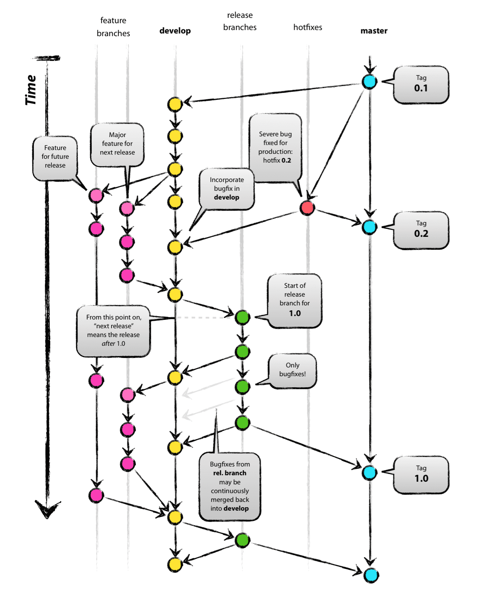

# Git-flow

- 2010년 Vincent Driessen에 의해 고안된 고수준의 레포지토리를 운영하는데 제공되는 Git 브랜칭 모델이다.

  > **병합(merge) 기반 솔루션**으로 `feature` 브랜치를 rebase 하지 않는다.

- 표준 Git 명령어를 사용하는 경우, 수동으로 수행해야하는 **일부 작업을 자동화**해줌으로서 협업할 때 유용하게 사용된다.
- [우린 Git-flow를 사용하고 있어요](https://techblog.woowahan.com/2553/)

## 종류

- **master**: 제품으로 출시되는 main 브랜치
- **develop**: 다음 버전을 개발하는 브랜치
- **feature** : 주요 기능을 개발하는 브랜치
- **release** : 출시 버전을 준비하는 브랜치

  > _release를 시작하는데 명령어의 마지막 인자 [BASE](선택 사항)에서 SHA-1 hash 커밋을 지원한다._
  >
  > [Git과 SHA-1](https://www.designveloper.com/blog/hash-values-sha-1-in-git/)

- **hotfix**: 출시 버전에서 발생한 버그를 수정하는 브랜치

### reference

- https://nvie.com/posts/a-successful-git-branching-model/
- https://danielkummer.github.io/git-flow-cheatsheet/index.html
